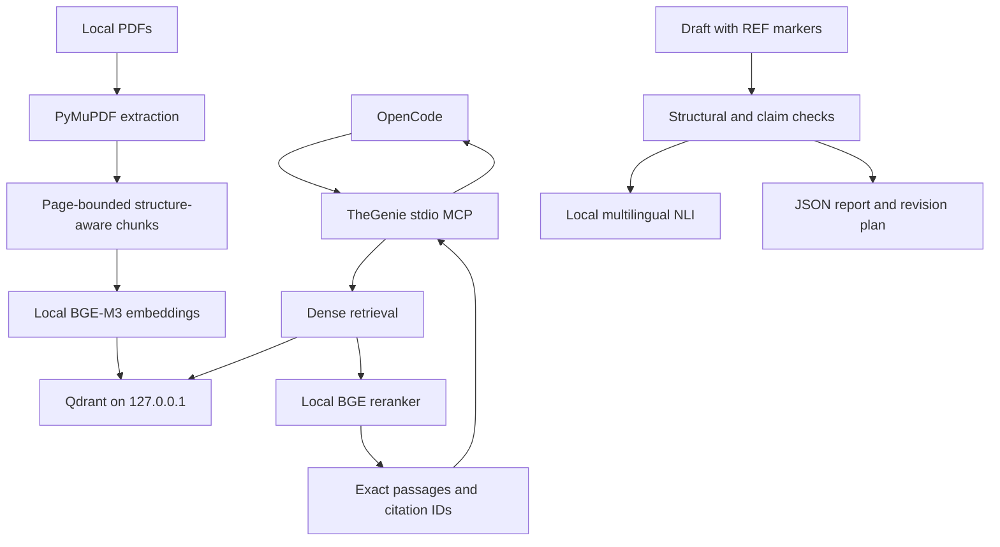

# TheGenie

TheGenie is a local academic retrieval and citation-verification system for OpenCode. It extracts and chunks local PDFs, creates embeddings locally, stores vectors in a loopback-only Qdrant instance, reranks passages locally, and checks draft citations and claim support locally.

TheGenie retrieves evidence; it is not a second writer model. OpenCode receives only the passages and document metadata returned by its read-only MCP tools—not complete PDFs, the vector index, or verification reports.

> **Phase 1 status:** the runtime is implemented with manual smoke checks. An automated test suite and benchmark are deferred to Phase 2. The system can detect and help correct unsupported claims, but it cannot guarantee hallucination-free writing.

New to TheGenie? [How TheGenie works, explained simply](docs/how-it-works-eli5.md) is a plain-language walkthrough of the whole pipeline before diving into the technical setup below.

Upgrading? [`CHANGELOG.md`](CHANGELOG.md) records notable changes, including the breaking replacement of `ingest --prune` with the standalone `prune` command in 0.2.0.

## Architecture



The implementation is one Python package and one `thegenie` CLI. There is no internal HTTP API, worker queue, hosted vector store, cloud embedding API, or cloud verifier.

## Requirements

- Linux
- Internet access for initial dependency and model downloads
- [`uv`](https://docs.astral.sh/uv/)
- Docker with the Compose plugin
- Sufficient storage and memory for Qdrant plus three local models
- OpenCode `1.18.25` for the documented integration

The package supports Python 3.11–3.13; this guide selects Python 3.12.

### Install prerequisites

Install Docker using your distribution’s or Docker’s official instructions. Confirm it works:

```bash
docker --version
docker compose version
```

Install `uv` using its official installer:

```bash
curl -LsSf https://astral.sh/uv/install.sh | sh
```

Open a new shell, or add the installer’s reported binary directory to `PATH`, then confirm:

```bash
uv --version
```

## From-zero setup

Run all following commands from the repository root, `/ABSOLUTE/PATH/TO/thegenie`, unless a command explicitly uses `--directory`.

### 1. Select Python and install dependencies

```bash
cd /ABSOLUTE/PATH/TO/thegenie
uv python install 3.12
uv python pin 3.12
uv sync
uv run thegenie --help
```

`uv run` uses the project environment; no separate activation step is required.

### 2. Configure TheGenie

Create the local environment file:

```bash
cp .env.example .env
```

The defaults are usable from the repository root. Settings use the `RAG_` prefix and are loaded from `.env`:

```dotenv
RAG_QDRANT_URL=http://127.0.0.1:6333
RAG_QDRANT_COLLECTION=academic_chunks
RAG_DOCUMENTS_PATH=documents
RAG_DATA_PATH=data
RAG_CACHE_PATH=data/cache
RAG_METADATA_PATH=data/metadata
RAG_VERIFICATION_PATH=data/verification

RAG_EMBEDDING_MODEL=BAAI/bge-m3
RAG_RERANKER_MODEL=BAAI/bge-reranker-v2-m3
RAG_NLI_MODEL=MoritzLaurer/mDeBERTa-v3-base-mnli-xnli
RAG_DEVICE=cpu
RAG_OFFLINE=false

RAG_CHUNK_SIZE=512
RAG_CHUNK_OVERLAP=64
RAG_EMBEDDING_BATCH_SIZE=16
RAG_VECTOR_CANDIDATES=20
RAG_RESULT_COUNT=5
RAG_DEDUPLICATION_THRESHOLD=0.9
RAG_SOURCE_DIVERSITY=true
RAG_ENTAILMENT_THRESHOLD=0.7
RAG_CONTRADICTION_THRESHOLD=0.7
RAG_LOG_LEVEL=INFO
```

Paths are relative to the process working directory. Keep OpenCode’s `uv run --directory ...` command exactly as shown later so it loads this project and its relative paths consistently.

Configuration rejects an overlap greater than or equal to chunk size and a result count greater than the candidate count.

### 3. Start Qdrant

```bash
docker compose config
docker compose up -d
docker compose ps
```

Qdrant listens only on `127.0.0.1:6333` and persists its index under `data/qdrant/`.

### 4. Download the local models

```bash
uv run thegenie models download
```

This downloads three models, each doing a different job:

- **Embedding** (`BAAI/bge-m3`): converts each PDF chunk, and each search query, into a dense vector once. Qdrant compares vectors by cosine similarity to cheaply narrow the whole index down to a shortlist of candidates (`RAG_VECTOR_CANDIDATES`, default 20). Fast, but only approximately relevant — embeddings compress meaning into one fixed-size vector, which loses nuance.
- **Reranker** (`BAAI/bge-reranker-v2-m3`): a cross-encoder that reads the query and each shortlisted candidate passage together (not as separate vectors) and scores that specific pair directly. Much slower per pair, so it only runs on the small shortlist the embedding step already narrowed down, but far more accurate at judging whether a passage is actually relevant to the query. Its score is a relevance estimate, not proof that the passage supports a claim.
- **Evidence NLI** (`MoritzLaurer/mDeBERTa-v3-base-mnli-xnli`): a separate natural-language-inference cross-encoder used only during `thegenie verify`, not during search. It scores whether a cited passage entails, contradicts, or is neutral toward a specific claim in your draft — this is what backs the `SUPPORTED`/`CONTRADICTED`/etc. verdicts.

Models are cached under `data/cache/` by default and loaded lazily by ordinary commands. Downloads can be large and may take substantial time on CPU-only machines.

Optionally set a [Hugging Face access token](https://huggingface.co/settings/tokens) before downloading:

```dotenv
RAG_HF_TOKEN=hf_...
```

These models are public, so a token is not required, but Hugging Face applies stricter, lower rate limits to anonymous downloads. An authenticated token raises those limits and is the most common fix for slow or failing model downloads. Add `--verbose` to any command (for example `uv run thegenie --verbose models download`) to see per-file download and cache logging while diagnosing issues.

After a successful download, set this for network-independent operation:

```dotenv
RAG_OFFLINE=true
```

`thegenie health` checks local availability without intentionally downloading models.

#### CPU and GPU

The default is portable but slower:

```dotenv
RAG_DEVICE=cpu
```

`pyproject.toml` pins the CPU-only PyTorch wheel index by default so `uv sync` does not download unused NVIDIA CUDA libraries on machines without an NVIDIA GPU. If you have a CUDA-capable NVIDIA GPU, remove the `[tool.uv.sources]`/`[[tool.uv.index]]` entries for `torch` in `pyproject.toml`, re-run `uv sync`, and set:

```dotenv
RAG_DEVICE=cuda
```

Device availability, compatible PyTorch installation, memory, and performance are machine-specific. Reduce `RAG_EMBEDDING_BATCH_SIZE` if ingestion runs out of memory.

### 5. Add PDFs

Place PDFs anywhere beneath `documents/`:

```text
documents/
├── article.pdf
└── topic/
    └── کتاب.pdf
```

Unicode filenames and Persian text are supported. PDFs and generated data are ignored by Git. Image-only/scanned pages require OCR before ingestion; OCR is not included.

### 6. Ingest PDFs

```bash
uv run thegenie ingest ./documents
```

Ingestion recursively discovers PDFs. New and changed files are indexed; unchanged files skip extraction and model loading. The manifest is stored at `data/metadata/index.json`.

Changed documents keep their persistent document ID. New chunks are inserted before points for the old document hash are deleted, and a failed replacement leaves the previous valid index intact.

Ingestion never deletes anything. Removing stale index data is a separate command that indexes nothing and loads no model:

```bash
uv run thegenie prune --dry-run   # report what would be deleted
uv run thegenie prune             # delete it
```

`prune` removes two kinds of stale data:

- `missing_source` — the manifest lists a PDF that has been deleted from disk.
- `orphan_vectors` — Qdrant holds points the manifest does not account for. Because chunk batches are upserted before the manifest entry is written, an ingest run interrupted mid-document leaves points behind, and a retry allocates a fresh document ID, so nothing else reclaims them. Until pruned they stay searchable and citable as a partial duplicate.

Pass a path to limit the `missing_source` pass to entries beneath it. The `orphan_vectors` sweep is always index-wide, since an orphaned group has no manifest entry to scope it by:

```bash
uv run thegenie prune ./documents/subfolder
```

Run `prune --dry-run` first when the scope is narrow.

### 7. Search and inspect evidence

```bash
uv run thegenie search "trust formation in online communities"
uv run thegenie search "اعتماد اجتماعی" --top-k 8
uv run thegenie search "specific claim" --document-filter article.pdf
```

`--document-filter` accepts an exact document ID, filename, or title. Search performs local query embedding, Qdrant candidate retrieval, local reranking, overlap deduplication, and source-diverse selection.

A relevance estimate ranks passages; it is not a probability that a passage supports a claim. Inspect the exact text. Resolve any returned citation ID with:

```bash
uv run thegenie reference CITATION_ID
```

## Draft, cite, verify, and revise

Retain TheGenie’s internal citation markers while drafting:

```text
The cited study reports the stated relationship. [[REF:article_p3_c_ab12cd34ef56]]
```

Use the exact ID returned by search; never create an ID, page, author, year, title, DOI, quotation, or result from memory.

Resolve unique markers into inspectable bibliography metadata:

```bash
uv run thegenie citations proposal.md
```

Run structural and semantic verification:

```bash
uv run thegenie verify proposal.md
uv run thegenie verify proposal.md --strict
```

Structural checks distinguish malformed or unknown citations, missing or changed source PDFs, invalid pages, and chunk mismatches. Claim checks use deterministic quote/number/negation/attribution/strength rules plus local multilingual NLI.

Normal verification exits nonzero for structural failures, contradictions, and quote mismatches. Strict mode also fails partially supported, unsupported, and unverifiable literature claims. Confidence is an evidence assessment, not proof of truth.

Reports are written beneath `data/verification/`, for example:

```text
data/verification/proposal.md.verification.json
```

Reports can contain sensitive draft claims and retrieved evidence. Keep that directory private.

Create a bounded revision plan:

```bash
uv run thegenie revise proposal.md
```

This reruns verification and writes JSON and readable Markdown plans beneath `data/verification/`. It does **not** edit the draft and does not invoke a writer model. A human or OpenCode must review and apply any proposed change.

## Health

```bash
uv run thegenie health
```

The command returns JSON and exits nonzero unless all required checks pass:

- Qdrant is reachable;
- the collection exists;
- all three models are locally available;
- the configured documents directory exists.

It also reports indexed document and chunk counts. Before the first successful ingestion, Qdrant may be reachable while the collection does not yet exist; ingest a PDF to create it.

## OpenCode 1.18.25 integration

For Claude Code, or any other MCP-capable agent, see
[`docs/setup/`](docs/setup/README.md) instead — it covers OpenCode, Claude
Code, and the generic `mcpServers` config shape used by most other clients,
plus how to carry over `AGENTS.md`'s evidence-discipline instructions to an
agent that doesn't read it automatically.

The installed version was confirmed with `opencode --version`. The V2 local MCP shape was also checked against the official [OpenCode MCP server documentation](https://opencode.ai/docs/mcp-servers/) and [configuration documentation](https://opencode.ai/docs/config/): a local server uses `type: "local"` and an argv-array `command`.

Create or merge this exact JSON into `opencode.json` in the project where you run OpenCode, replacing only `/ABSOLUTE/PATH/TO/thegenie` with the real absolute repository path:

```json
{
  "$schema": "https://opencode.ai/config.json",
  "mcp": {
    "thegenie": {
      "type": "local",
      "command": [
        "uv",
        "run",
        "--directory",
        "/ABSOLUTE/PATH/TO/thegenie",
        "thegenie",
        "mcp"
      ],
      "enabled": true,
      "timeout": 30000
    }
  }
}
```

The equivalent shell command is:

```bash
uv run --directory /ABSOLUTE/PATH/TO/thegenie thegenie mcp
```

The process is a long-running stdio MCP server. Running it directly will appear to wait for input; that is expected. OpenCode owns its stdin/stdout and restarts it with the OpenCode session.

Restart OpenCode after changing the config, then inspect server status:

```bash
opencode mcp list
```

The server exposes only:

- `thegenie_search_references`
- `thegenie_get_reference`
- `thegenie_list_documents`

OpenCode tool names are prefixed with the configured server name. If your installed UI renders punctuation differently, use the actual name shown in its tool trace.

### What OpenCode actually runs

OpenCode runs only `thegenie mcp`. It discovers and invokes `search_references`, `get_reference`, and `list_documents` through the MCP protocol. It does **not** run `thegenie ingest`, `search`, `reference`, `verify`, `revise`, `citations`, `health`, or `models download`. Those are human-operated CLI commands.

`list_documents` returns only filenames, document IDs, chunk counts, and index timestamps for what is currently ingested — no document text. Use it to see what evidence sources exist before searching, or to confirm a `--document-filter`/`document_filter` value is spelled correctly.

Prompt explicitly when checking integration:

```text
Use thegenie_search_references to find local evidence about trust formation.
Show the exact returned citation marker and passage. Then use
thegenie_get_reference on that citation ID before making a claim.
```

Do not infer successful retrieval merely because the answer sounds sourced. Expand OpenCode’s tool-call/activity trace and confirm the actual invocation name, arguments, and result. You should see `thegenie_search_references`, followed by `thegenie_get_reference` when exact provenance is requested. The returned result must contain a local citation ID, page, and exact passage.

For startup diagnostics, run OpenCode with logs visible:

```bash
opencode --print-logs --log-level DEBUG
```

Then inspect the MCP status and tool activity in that session. You can also validate the resolved configuration with:

```bash
opencode debug config
```

OpenCode’s `mcp debug` command is aimed primarily at remote/OAuth connections; for this local stdio server, the process logs and tool trace are the useful evidence.

## Privacy and token savings

The following remain local during normal operation:

- PDFs and extracted text;
- chunks and embeddings;
- Qdrant storage;
- search queries sent to TheGenie;
- reranking;
- citation and claim verification;
- model cache, manifest, and verification reports.

Qdrant is bound to loopback. TheGenie needs no API key and stores none. Logs should contain identifiers, counts, timings, and errors rather than full document text.

Only the small number of passages selected by MCP enter OpenCode’s conversation and therefore may enter the configured OpenCode/OpenRouter model request. This saves tokens compared with attaching whole PDFs: complete documents do not consume the model context, while query-specific passages do. It also reduces—without eliminating—the amount of source text sent to the model provider. Treat every MCP passage visible in an OpenCode session as data shared with that session’s provider under its privacy terms.

Avoid enabling unrelated MCP servers unnecessarily: their tool schemas and outputs also consume context.

## Phase 1 manual acceptance

Phase 1 deliberately has no automated test suite. Run this acceptance flow after setup, using a PDF whose content and page number you can inspect manually.

1. Check the command surface and Compose configuration:

   ```bash
   uv run thegenie --help
   docker compose config
   ```

2. Start Qdrant, download models, and ingest the fixture PDF:

   ```bash
   docker compose up -d
   uv run thegenie models download
   uv run thegenie ingest ./documents
   uv run thegenie health
   ```

   Accept only if health reports `"status": "ok"`, models are `true`, Qdrant and the collection are available, and counts are nonzero.

3. Search for a distinctive sentence or concept from the fixture:

   ```bash
   uv run thegenie search "fixture-specific question"
   ```

   Confirm the result text is exact extracted wording and its one-based PDF page is correct by opening the source PDF.

4. Resolve the returned citation:

   ```bash
   uv run thegenie reference CITATION_ID
   ```

   Confirm citation ID, filename/source path, page, and passage agree with the search result and PDF.

5. Create `acceptance.md` with one narrowly supported claim and its exact `[[REF:CITATION_ID]]` marker. Then run:

   ```bash
   uv run thegenie citations acceptance.md
   uv run thegenie verify acceptance.md --strict
   uv run thegenie revise acceptance.md
   ```

   Inspect the generated verification JSON and revision JSON/Markdown. A genuinely supported claim should pass strict verification, but model judgments still require human review.

6. Exercise failures manually with copies of the draft: malformed and unknown markers, a changed/missing PDF, a wrong number, an exaggerated or contradictory claim, and a fabricated quotation. Confirm the reported categories are actionable. Restore/reingest the source after mutation checks.

7. Check pruning with a disposable PDF. Ingest it, delete the file from `documents/`, then run:

   ```bash
   uv run thegenie prune --dry-run
   uv run thegenie prune
   uv run thegenie prune
   ```

   Accept only if the dry run reports the entry as `missing_source` and changes nothing, the real run removes it, the second real run reports `nothing to prune`, and the Qdrant `points_count` afterwards equals the sum of `chunk_count` across `data/metadata/index.json`. That equality is the check for orphaned vectors.

8. Add the OpenCode config above, restart OpenCode, run `opencode mcp list`, and issue the explicit integration prompt. Confirm the visible tool trace contains the real MCP invocation and that its passage/page match CLI resolution and the PDF.

Record exactly which steps passed, failed, or were unavailable. Passing these smoke checks completes only Phase 1 manual acceptance. Full project acceptance requires the deferred Phase 2 automated regression, integration, real-model, MCP, and adversarial benchmark coverage.

## Troubleshooting

### `uv` is not found

Open a new shell after installation or add the path reported by the `uv` installer to `PATH`. Confirm with `uv --version`.

### Dependency or model download fails

Initial setup requires network access to Python package indexes and Hugging Face. Retry on a stable connection and verify available disk space. Keep `RAG_OFFLINE=false` until all three models download successfully. If downloads are slow or rate-limited, set `RAG_HF_TOKEN` (see above). Add `--verbose` to any command to see per-file download and cache activity.

### Health reports models as unavailable

Run:

```bash
uv run thegenie models download
```

Ensure `RAG_CACHE_PATH`, model names, and the working directory match those used by health and MCP. If you moved the cache, update `.env` before setting `RAG_OFFLINE=true`.

### Qdrant is unreachable

```bash
docker compose ps
docker compose logs qdrant
curl http://127.0.0.1:6333/healthz
```

Check that Docker is running and no other process occupies port 6333. The Compose service intentionally does not bind to a non-loopback address.

### Qdrant is reachable but the collection is missing

Run ingestion once. The collection dimension is discovered from the embedding model and created automatically:

```bash
uv run thegenie ingest ./documents
```

### Ingestion finds no PDFs

Confirm the path exists, files end in `.pdf`, and the command runs from the expected directory. Check `RAG_DOCUMENTS_PATH` when using the default path.

### Empty or poor extracted text

The PDF may be scanned, image-only, encrypted, or have a difficult text layer. OCR is not built in; OCR the source externally and ingest the resulting searchable PDF. Always compare critical passages against the rendered source.

### Out-of-memory or very slow inference

Reduce `RAG_EMBEDDING_BATCH_SIZE` if memory is the constraint, keep `RAG_DEVICE=cpu` unless a compatible accelerator is configured, close competing workloads, and expect the first model load to be slower. Large BGE models are computationally expensive.

Do not expect batch size or thread count to improve CPU throughput. On CPU, bge-m3 embedding is memory-bandwidth bound rather than core bound: on one 8-core machine, 4, 8, and 16 torch threads measured 4210, 3943, and 3901 ms per 1000-token chunk, and batch sizes 8, 16, and 32 were within noise of each other. Embedding dominates ingestion at roughly 1.8 s per 512-token chunk, so a 70-chunk paper takes about two minutes and low apparent CPU utilization is expected.

### Ingestion seems to take far too long on one PDF

Ingest prints the current filename and its embedded-chunk count, so compare progress against the figures above. If the chunk counter never appears, the document is still being extracted or chunked, which normally takes well under a second per paper — a document stuck there for minutes is not embedding.

Versions before 0.2.0 contained a chunking defect that could loop forever on certain documents, presenting as an ingest that never finishes rather than as an error. If you are on an older version, upgrade; see `CHANGELOG.md`.

### Search returns irrelevant or duplicate passages

Use a more specific query, increase `--top-k` only when needed, or use `--document-filter`. Tune `RAG_VECTOR_CANDIDATES`, `RAG_RESULT_COUNT`, and `RAG_DEDUPLICATION_THRESHOLD` cautiously. Dense retrieval can miss relevant evidence and reranking can be wrong.

If near-duplicate passages appear from a document you only indexed once, an earlier interrupted ingest may have left orphaned vectors behind. Run `uv run thegenie prune --dry-run` to check, then `uv run thegenie prune` to remove them.

### Citation reports changed or missing sources

Restore the indexed source or reingest its current version. Do not silently substitute a new passage: text changes intentionally change citation fingerprints.

### OpenCode shows no MCP server or tools

- Use an absolute project path in `opencode.json`.
- Ensure the config is in the OpenCode project root or global config location.
- Validate with `opencode debug config`.
- Confirm `uv` is visible in the environment that launches OpenCode.
- Run `opencode mcp list`.
- Restart OpenCode after config changes.
- Run `uv run --directory /ABSOLUTE/PATH/TO/thegenie thegenie mcp` manually; waiting silently is normal, while an immediate error is not.
- Start OpenCode with `--print-logs --log-level DEBUG` and inspect the startup error.

### OpenCode answers without using local evidence

Ask it explicitly to use `thegenie_search_references`, and inspect the tool trace. An answer with no visible MCP invocation and no exact returned `[[REF:...]]` marker is not evidence that TheGenie was consulted.

### Verification rejects a plausible claim

Inspect the exact cited passage, numbers, negation, attribution, scope, and modal strength. NLI and claim extraction can be wrong. Revise narrowly only when source review supports the change; otherwise retain the claim for human adjudication rather than optimizing prose to satisfy the model.

## Limitations

- Dense semantic retrieval can miss relevant evidence.
- A high relevance score does not establish claim support or truth.
- Retrieval currently has no lexical/BM25 index.
- Claim extraction, citation-to-claim association, deterministic rules, and NLI can be wrong.
- Persian and multilingual verification quality depends on the selected models and source text quality. Cross-lingual claim verification (e.g. a Persian claim citing an English source) has been tested and works well for entailment/contradiction, and Persian-script digits are normalized to match Latin-digit values in a source. However, exact-quote verification only matches literal source wording: a **translated** quotation wrapped in quotation marks (e.g. paraphrasing an English sentence into Persian and quoting that translation) will report `QUOTE_MISMATCH` even when the translation is accurate. Quote only in the source's own original language and script; state translated content as a paraphrase, without quotation marks.
- Write cited claims as the bare proposition, not wrapped in reporting phrases like "X et al. found that," "According to X," or "In this study,". The `[[REF:...]]` marker already carries attribution; wrapping the same sentence in reporting language can weaken the automated semantic verification step even when the underlying claim is fully supported. See `AGENTS.md` and the citation-style skill in `docs/setup/`.
- PDF extraction can reorder text. For a page with little or no embedded text (a scanned/image-only page), extraction falls back to OCR via the system `tesseract` binary if it is installed; if `tesseract` isn't on PATH, that page's warning is reported instead and its text stays sparse. This fallback recovers page text but not layout, so headings/sections are not detected on OCR'd pages. It is not a full document OCR pipeline — for a document that is entirely scanned, sourcing a genuine text-based copy of the PDF is still the more reliable fix.
- Chunks never span pages, which improves citation clarity but can separate context.
- Source metadata may be absent; TheGenie deliberately leaves uncertain fields empty.
- Verification evaluates cited passages, not the complete literature or real-world truth.
- Revision plans are suggestions and never edit prose automatically.
- Reports contain draft text and evidence and must be protected accordingly.
- Phase 1 has manual checks only; automated regression and adversarial benchmark coverage are deferred.
- Serious academic work still requires reading primary sources, checking page context, applying disciplinary standards, and human editorial judgment.
- TheGenie reduces unsupported claims and unnecessary context transfer; it does not make hallucinations impossible.

## CLI reference

All operations use the single `thegenie` entry point:

```text
thegenie ingest PATH
thegenie prune [PATH] [--dry-run]
thegenie search QUERY [--top-k N] [--document-filter VALUE]
thegenie reference CITATION_ID
thegenie citations DOCUMENT
thegenie verify DOCUMENT [--strict]
thegenie revise DOCUMENT
thegenie health
thegenie models download
thegenie mcp
```

Use `uv run thegenie ...` from the repository root, or `uv run --directory /ABSOLUTE/PATH/TO/thegenie thegenie ...` from elsewhere.
