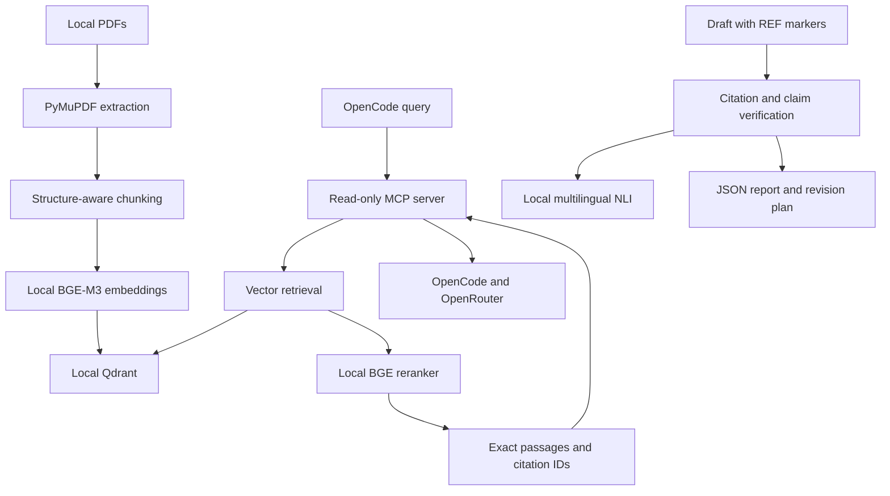

# Local Academic RAG System Design

Date: 2026-08-31
Status: Revised after written-spec review; awaiting final approval

## Purpose

Build a local academic reference retrieval system for OpenCode. PDFs remain local during extraction, chunking, embedding, vector search, reranking, citation validation, and claim-level evidence verification. OpenCode receives only retrieved passages needed for its current writing task.

The system retrieves evidence; it does not answer academic questions or run a second writer model.

## Architecture



Implementation uses one modular Python package named `thegenie` and one local Qdrant service. CLI and MCP share services. No internal HTTP API, worker queue, hosted vector store, cloud embedding API, or cloud verifier exists.

## Runtime and dependencies

- Python 3.12 managed by `uv`; package supports Python 3.11 through 3.13.
- PyMuPDF extracts PDFs and generates test fixtures.
- Sentence Transformers provides local dense embeddings, reranking, and multilingual NLI cross-encoding.
- Qdrant stores cosine vectors and payload metadata.
- MCP Python SDK provides a stdio server.
- Pydantic and Pydantic Settings validate models and configuration.
- pytest provides tests in Phase 2; Phase 1 does not implement automated tests.
- Docker Compose runs Qdrant on loopback only.

Default models:

- Embedding: `BAAI/bge-m3`
- Reranker: `BAAI/bge-reranker-v2-m3`
- Evidence NLI: `MoritzLaurer/mDeBERTa-v3-base-mnli-xnli`

All model names, cache paths, devices, batch sizes, and thresholds are configurable. Models load lazily once per process and work offline after download.

## Package boundaries

- `config`: central validated environment configuration.
- `models`: shared domain and API schemas.
- `pdf`: exact page extraction, conservative metadata extraction, heading detection, and chunking.
- `embeddings`: cached local embedder.
- `database`: Qdrant collection lifecycle and chunk operations.
- `ingestion`: discovery, hashing, manifest reconciliation, replacement, and batching.
- `retrieval`: vector candidates, local reranking, deduplication, and source diversity.
- `citation`: deterministic IDs, resolution, formatting, and structural validation.
- `verification`: claim extraction/classification, deterministic evidence checks, local NLI, reports, revision plans, and benchmark evaluation.
- `mcp`: read-only tools.
- `cli`: one `thegenie` entry point with focused subcommands.

No single-implementation interfaces or service container are required. Constructors accept concrete dependencies where tests need substitutes.

## Stored data

Each Qdrant chunk point stores a dense vector and payload containing:

- Persistent `document_id`, assigned once to a canonical relative source path.
- Current PDF SHA-256 `document_hash`.
- Relative source path and Unicode filename.
- Nullable title, authors, year, DOI, and source type.
- One-based PDF page.
- Detected section.
- Sequential chunk index.
- Exact extracted chunk text.
- Deterministic citation ID and chunk fingerprint.

Unavailable metadata remains null. Filename and relative path always remain available. The system never infers uncertain bibliography fields.

Citation IDs use:

```text
<filename-slug>_p<page>_c_<fingerprint>
```

The fingerprint derives from persistent document ID, page, and exact chunk text. It remains stable when sequence positions shift, but changes when source text or page changes. Unicode filenames receive a deterministic Unicode-aware slug with a hash fallback.

The local manifest at `data/metadata/index.json` tracks source path, document ID, current hash, indexed timestamp, and chunk count. Writes use an atomic temporary-file replacement.

## PDF extraction and chunking

Ingestion streams one PDF at a time. PyMuPDF extracts metadata and text page-by-page. Block font size, bold flags, short-line shape, numbering patterns, and surrounding body-size statistics identify likely headings. Detection is conservative; unknown sections remain null.

Chunking follows sections, paragraphs, sentences, then hard token-estimate splits only when required. It targets configured size and overlap while preserving exact extracted wording. Overlap reuses complete trailing paragraphs or sentences where practical. Chunks never span PDF pages, preserving unambiguous page citations.

Token counts use the configured embedding tokenizer when available during ingestion. Unit-level chunking can use a deterministic Unicode word estimate without loading a model.

Image-only pages log warnings. OCR is not included. Documentation identifies OCR and extraction quality as limitations.

## Incremental ingestion

`thegenie ingest PATH` recursively discovers PDFs and hashes them without loading complete files into memory.

Files classify as new, changed, or unchanged:

- Unchanged files skip extraction and model loading.
- New files receive persistent document IDs and are indexed in batches.
- Changed files keep document IDs. New chunks upsert first; points carrying the previous document hash delete afterward; manifest updates last.
- Failed documents leave their previous valid index and manifest entry intact.

Default ingestion does not delete entries for missing files, allowing citation verification to report missing sources. `--prune` explicitly deletes manifest entries and vectors missing beneath the scanned root. This avoids accidental deletion when indexing a subdirectory.

> **Superseded in 0.2.0.** The `ingest --prune` flag was replaced by a standalone `thegenie prune [PATH] [--dry-run]` command, because coupling deletion to ingestion meant pruning one removed file also re-indexed the entire scanned root. The upsert-before-manifest order recorded above is also now known to orphan vectors when a run is interrupted; `prune` reclaims them. See `CHANGELOG.md`.

Output reports found, unchanged, changed, new, per-document chunk counts, failures, and total updated chunks. Logs never include full document text.

## Qdrant

Docker Compose binds Qdrant to `127.0.0.1:6333` and persists data in `./data/qdrant`. The application creates the collection automatically using cosine similarity and embedding dimension discovered from the configured model.

Payload indexes cover citation ID, document ID, document hash, filename, and source path.

Database operations include:

- `upsert_chunks`
- `delete_document`
- `search`
- `get_chunk`
- `document_exists`
- document/chunk counts for health checks

These operations are internal and never exposed through MCP.

## Retrieval

`search_references` validates input, embeds the query locally, asks Qdrant for the configured candidate count (default 20), optionally filters by filename/title/document ID, reranks query-passage pairs locally, removes near-identical overlapping chunks, applies source diversity, and returns the configured result count (default 5).

Deduplication compares normalized text overlap within the same document. Source diversity first admits the strongest result per document, then fills remaining slots by score. It does not suppress stronger same-document passages when too few independent sources exist.

Reranker scores are relevance estimates, not claim-support probabilities. Public output says so.

The first release uses dense vector retrieval only. Candidate generation remains isolated inside retrieval so future lexical/BM25 candidates can merge before reranking without changing CLI or MCP contracts. No speculative lexical dependency or index is added now.

## MCP server

The stdio MCP server exposes only:

```text
search_references(query: str, top_k: int = 5, document_filter: str | None = None)
get_reference(citation_id: str)
```

`search_references` returns concise Markdown with result label, title or filename, known authors/year, page, section, citation marker, relevance estimate, and exact passage. Tool instructions require OpenCode to inspect passages, distinguish relevance from support, avoid invented references or metadata, and cite only passages that support claims.

`get_reference` returns one exact stored passage and complete known source metadata.

Models and Qdrant clients initialize once and are reused. MCP exposes no ingestion, insertion, deletion, reset, collection, embedding, or verification operation.

## CLI

One package entry point exposes subcommands:

```text
thegenie ingest ./documents
thegenie search "trust formation"
thegenie reference CITATION_ID
thegenie verify proposal.md
thegenie revise proposal.md
thegenie citations proposal.md
thegenie health
thegenie evaluate
thegenie mcp
```

No duplicate script entry points are required. `thegenie health` checks Qdrant reachability, collection existence, local model availability, source directory existence, indexed document count, and indexed chunk count. It does not silently download models.

`thegenie citations` resolves unique citation markers into inspectable bibliography metadata. Formatting uses a small formatter boundary so APA, IEEE, or Chicago output can be added later without changing retrieval.

## Citation validation

Stage 1 validates every marker and resolved source:

- Marker syntax.
- Citation existence.
- Stored citation/payload agreement.
- Source file existence.
- Current PDF hash against indexed hash.
- Referenced page existence.
- Chunk fingerprint agreement.

Failures remain distinct:

```text
MALFORMED_CITATION
UNKNOWN_CITATION
MISSING_DOCUMENT
CHANGED_DOCUMENT
INVALID_PAGE
CHUNK_MISMATCH
```

This stage does not claim that a valid citation supports surrounding prose.

## Claim-level evidence verification

Claim extraction splits paragraphs and sentence punctuation, including Persian punctuation, while retaining citations and offsets. Adjacent clauses sharing one citation may remain grouped. A citation at paragraph end does not automatically cover unrelated earlier claims.

Claims classify as:

```text
LITERATURE_CLAIM
GENERAL_FACT
INFERENCE
OPINION
TRANSITION
PROCEDURAL
UNCERTAIN
```

Narrow deterministic rules identify transitions and procedures. Numerical, quoted, attributed, dated, and literature-signaling statements default to literature claims. Ambiguous classification uses the local multilingual NLI model.

Literature claims undergo checks in this order:

1. Exact or normalized quote matching.
2. Exact number, date, percentage, sample-size, and statistical-value comparison.
3. Negation and contradiction patterns.
4. Attribution comparison where source metadata permits it.
5. Multilingual NLI entailment, neutrality, and contradiction scoring.
6. Claim-strength rules for modal removal, association-to-causation changes, factor-to-primary/only changes, and unsupported generalization.

Verdicts:

```text
SUPPORTED
PARTIALLY_SUPPORTED
UNSUPPORTED
CONTRADICTED
UNVERIFIABLE
QUOTE_MISMATCH
```

`QUOTE_MISMATCH` remains explicit and is a hard failure. Confidence is reported as HIGH, MEDIUM, or LOW and described as an evidence assessment, never proof of truth.

For failed literature claims, optional independent local retrieval may suggest passages that appear more relevant. It reports possible citation mismatches but never silently changes citations.

## Verification commands and reports

`thegenie verify DOCUMENT` performs structural and semantic checks, prints a claim summary and actionable failures, and writes machine-readable JSON under `data/verification/`.

Normal mode exits nonzero for structural failures, contradictions, and quote mismatches. `--strict` also fails partially supported, unsupported, and unverifiable literature claims.

`thegenie revise DOCUMENT` never edits prose and never calls a writer model. It writes a bounded revision plan containing failed claim, reason, suggested action, current evidence, and possible alternative local citations. OpenCode or a human applies revisions.

Reports contain draft claims and retrieved evidence but no secrets. Documentation warns users that these reports may contain sensitive draft text.

## Benchmark

A versioned benchmark contains at least 30 claim/source/expected-verdict records covering support, mismatch, contradiction, numerical errors, attribution errors, overgeneralization, causal strengthening, and fabricated quotes.

`thegenie evaluate` runs the configured local verifier and reports per-class precision, recall, F1, macro F1, and a confusion matrix. It never describes the result as proof of hallucination-free generation.

Fast unit tests mock NLI scores to isolate deterministic logic. Model-marked tests exercise the real NLI backend after model download.

## Delivery phases

### Phase 1: working system

Phase 1 implements complete runtime functionality, including ingestion, retrieval, MCP, citation validation, local claim-level verification, revision plans, health checks, CLI, configuration, Docker Compose, OpenCode integration, and documentation.

Phase 1 does not create the automated test suite or benchmark implementation. It includes focused manual smoke checks for imports, CLI help, Qdrant connectivity, generated-PDF ingestion, retrieval, MCP startup, and citation verification. Phase 1 must not claim full production acceptance because automated regression and adversarial verification coverage remain pending.

### Phase 2: automated testing and benchmark

Phase 2 implements the retained test and benchmark design below, then runs the complete acceptance flow and fixes failures.

## Test strategy

Phase 2 tests cover:

- Page preservation, chunk boundaries, overlap, metadata, oversized paragraphs, and Persian text.
- New, unchanged, changed, duplicate, replacement, missing, and pruned documents.
- Relevant ranking, top-K, deduplication, diversity, and filters.
- Valid, malformed, unknown, missing-source, changed-source, invalid-page, and mismatched citations.
- All requested adversarial evidence cases.
- MCP tool schemas, compact output, exact reference resolution, and stdio startup.
- Configuration, health checks, and CLI exit behavior.

Test layers:

1. Fast unit tests with fake model/repository dependencies.
2. Qdrant integration tests against Docker.
3. Generated real PDF fixture using PyMuPDF.
4. Real MCP client session.
5. Optional real-model tests.
6. Full acceptance flow: generated PDF, ingestion, Qdrant retrieval, MCP result, draft citation, structural/semantic verification, and JSON report.

Ordinary unit tests require no network or model downloads. Full acceptance requires Qdrant and downloaded models.

## Configuration

Pydantic Settings loads `.env` and `RAG_*` variables. Configuration includes:

- Qdrant URL and collection.
- Documents, data, cache, metadata, and verification paths.
- Embedding, reranker, and NLI model names.
- Device and offline mode.
- Chunk size and overlap.
- Embedding batch size.
- Vector candidate and final result counts.
- Deduplication and diversity controls.
- Evidence thresholds.
- Logging level.

Defaults match requested values where specified. Paths resolve relative to project working directory. Validation rejects impossible limits and overlaps.

## Security and privacy

- Qdrant binds loopback only.
- PDFs, extracted text, embeddings, queries, reranking, and verification remain local.
- Only MCP results selected for OpenCode enter its OpenRouter request context.
- No API keys are required or stored.
- `.env`, Qdrant files, model cache, manifests, verification reports, and generated metadata are ignored by Git where appropriate.
- Logs contain identifiers, counts, timings, and errors, not complete passages by default.

## OpenCode integration

README provides current OpenCode V2 local MCP configuration after checking installed OpenCode `1.18.25`. Configuration uses an absolute project path placeholder and launches one long-running stdio process:

```text
uv run --directory /ABSOLUTE/PATH/TO/thegenie thegenie mcp
```

OpenCode does not invoke ingestion, search, verification, or health CLI subcommands. It starts `thegenie mcp`, discovers `search_references` and `get_reference`, and invokes those tools through MCP. Humans use other CLI subcommands for indexing, debugging, and draft validation.

Documentation explains restart, tool discovery, debug logging, and how to confirm `academic-rag_search_references` was invoked instead of trusting an uncited answer.

`AGENTS.md` instructs OpenCode to retrieve evidence per subsection/claim, inspect exact passages, prefer primary and independent sources, avoid fabricated metadata and page numbers, retain internal `[[REF:...]]` markers, distinguish local evidence from general knowledge, avoid unnecessary repeated retrieval, and run verification before finalization.

## Documentation and operations

README starts from Linux prerequisites and covers repository setup, `uv`, Python 3.12, Docker Compose, model download, PDF placement, ingestion, search, health, OpenCode MCP configuration, acceptance testing, citation verification, revision plans, benchmark evaluation, privacy, performance, and troubleshooting.

It explains token savings: complete PDFs never enter OpenCode context; only a few query-specific passages do.

It states limitations:

- Semantic retrieval can miss evidence.
- Relevance does not guarantee support.
- Claim extraction and NLI can be wrong.
- Persian verification quality depends on models.
- OCR and PDF extraction affect results.
- Source metadata may be unavailable.
- Serious academic work still needs human source review.
- System detects and helps correct unsupported claims; it cannot guarantee hallucination-free generation.

## Acceptance criteria

Phase 1 is complete when runtime features and documented manual smoke checks work. Full project acceptance occurs after Phase 2, when:

1. Unit suite passes without network.
2. Qdrant integration suite passes.
3. Real-model smoke tests pass after downloads.
4. Generated PDF acceptance flow returns exact page passage through MCP.
5. Draft containing returned citation ID passes structural validation.
6. Supported claim passes semantic verification.
7. Adversarial unsupported, contradictory, numerical, strengthening, and quote cases receive required failures.
8. JSON verification report and revision plan are generated.
9. README commands reproduce setup and acceptance flow.
10. OpenCode configuration is verified against installed version and documented.

No result or documentation claims that hallucinations are impossible.
